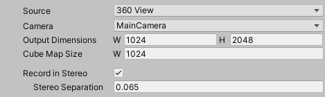

These properties appear when you set **Source** to **360 View**.

To capture 360 degree recordings, the Recorder rotates the **Camera** 360 degrees around its **Y** axis.

|Property||Function|
|-|-|-|
| **Camera** || Specifies which camera the Recorder uses to capture the 360 degree recording. |
|   | MainCamera   | The Camera tagged with the MainCamera [Tag](https://docs.unity3d.com/Manual/Tags.html). |
|   | TaggedCamera  | A camera tagged with a specific  [Tag](https://docs.unity3d.com/Manual/Tags.html).  If you select this option, you must enter a value in the **Tag** field. |
|**Tag**   |   | Specifies which Camera Tag to look for when you set **Camera** to **Tagged Camera**.|
| **Output Dimensions** || **W** and **H** specify the width and height, in pixels, of the 360-degree video. |
| **Cube Map Size** || The side length of the cube map, in pixels, for the 360-degree video. |
| **Record in Stereo** || Use this option to record separate left and right stereoscopic views of the 360-degree video.  The Recorder includes both views in the same image: left view at the top and right view at the bottom. |
| **Stereo Separation** || When you select **Record in Stereo**, this is the angle between the left and right views on the selected **Camera**'s **Y** axis. |
