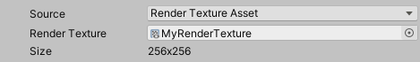

These properties appear when you set **Source** to **Render Texture Asset**.

|Property|Function|
|-|-|
| Render Texture | Points to the render texture you want the Recorder to capture. |
| Size | The actual dimensions (width x height) of the targeted Render Texture. |
