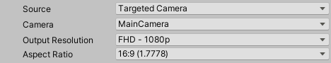

These properties appear when you set **Source** to **Targeted Camera**.

|Property||Function|
|-|-|-|
| **Camera** ||Specifies which camera the Recorder uses to capture the recording.  **Note:** some options might not appear if you're using certain render pipelines (for example [HDRP](https://docs.unity3d.com/Packages/com.unity.render-pipelines.high-definition@latest)).|
|   | ActiveCamera  | The Camera that is active when you launch the recording.  |
|   | MainCamera   | The Camera tagged with the MainCamera [Tag](https://docs.unity3d.com/Manual/Tags.html).  |
|   | TaggedCamera  | A camera tagged with a specific [Tag](https://docs.unity3d.com/Manual/Tags.html).  If you select this option, you must enter a value in the **Tag** field. |
|**Tag**   |   | Specifies which Camera Tag to look for when you set **Camera** to **Tagged Camera**.|
| **Output Resolution** || Allows you to set the dimensions of the recorded view using different methods. |
|   | Match Window Size  | Matches the resolution and aspect ratio of the currently selected Game View. |
|   | _[PRESET RESOLUTIONS]_ | Choose from several standard video resolutions such as FHD (1080p) and 4K (2160p).  The numeric value represents the image height. To set the image width, you must select a specific **Aspect Ratio**. |
|   |  Custom | Uses custom width and height values that you supply in the **W** and **H** fields. |
| **Aspect Ratio** || Specifies the ratio of width to height (w:h) of the recorded view when you set the **Output Resolution** to a preset resolution. |
|   | _[PRESET ASPECT RATIOS]_ | Choose from several standard aspect ratios such as 16:9 (1.7778) and 4:3 (1.3333). |
|   | Custom   | Uses a custom aspect ratio that you supply in the displayed fields (w:h). |
| **Include UI** ||Enable this option to include UI GameObjects in the recording.  This option only appears when you set **Source** to **ActiveCamera**.|
