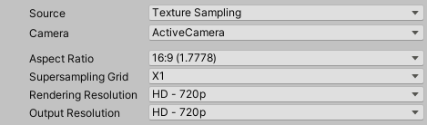

These properties appear when you set **Source** to **Texture Sampling**.

Use this capture method when the **Rendering Resolution** has the same or higher resolution than the **Output Resolution**.

|Property||Function|
|-|-|-|
| **Camera** ||Specifies which camera the Recorder uses to capture the recording.|
|   | ActiveCamera | The Camera that is active when you launch the recording. |
|   | MainCamera | The Camera tagged with the MainCamera [Tag](https://docs.unity3d.com/Manual/Tags.html). |
|   | TaggedCamera | A camera tagged with a specific [Tag](https://docs.unity3d.com/Manual/Tags.html).  If you select this option, you must enter a value in the **Tag** field. |
|**Tag**   |   | Specifies which Camera Tag to look for when you set **Camera** to **Tagged Camera**. |
| **Aspect Ratio** || The ratio of width to height of the recorded  output. |
| **Supersampling Grid**  |   | The size of the grid of sub-pixels to use for supersampling patterns. |
| **Rendering Resolution** || The vertical resolution of the input to sample from. |
| **Output Resolution** || The vertical resolution of the recording to output to. |
