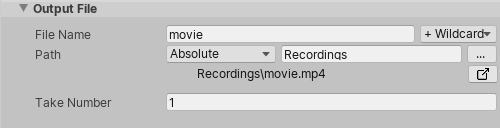

# Output File properties

Use these properties to define file output options for any type of Recorder.

|Property||Function|
|:---|:---|:---|
| **File Name** || The name of the output file. |
|   | _[TEXT FIELD]_ | Type the file name here.  **Tip:** You can use [placeholders](#available-placeholders) to include auto-generated text in the file name: use the **+Wildcards** drop-down menu or insert them manually. |
|   | **+Wildcards** menu | Allows you to quickly select [placeholders](#available-placeholders) for auto-generated text to append them to the **File Name** string. |
| **Path** ||Use these controls to configure the path to the folder where the Recorder saves output files.  Some Recorders can only output to specific locations. For example Animation Clip Recorders can only output to locations inside the Assets folder.|
|   | _[DROP-DOWN]_ |  Choose one of several pre-defined Unity folders, or choose **Absolute** to specify a custom path. |
|   | _[TEXT FIELD]_ | If you choose a predefined path from the drop-down menu, the Recorder appends anything you enter here to that path.  If you choose **Absolute** from the drop-down menu, you can enter the custom output path here.   **Note:** If you click the Output Location button (**...**) to choose an absolute path from the Unity file browser, the path you choose overwrites anything in this field.  **Tip:** You can manually insert [placeholders](#available-placeholders) to include auto-generated text in the path string. |
|   | Output Location button (**...**) | Opens a Unity file browser where you can choose a custom output path. When you choose a path this way, the Recorder automatically sets the drop-down menu to **Absolute**. |
|   | _[PATH]_ | Displays the full output path, as set in the **File Name** and **Path** properties, with resolved values for the [placeholders](#available-placeholders) (if any). |
|   | File Browser button    | Opens your operating system's file browser to the current path.  If the path doesn't exist, the Recorder tries to generate the necessary folder structure on disk. |
| **Take Number** || A value that the Recorder uses to number recordings. It increments by one after each recording.  If your Recorder List includes multiple recorders, the Take value simultaneously increments by one on all recorders except the ones that are inactive.  **Tip:** You can use the `<Take>` placeholder to append the current **Take** value to the **File Name**, for example. |

## Available placeholders (Wildcards)

You can insert placeholders in the **File Name** and **Path** fields to include auto-generated text in the file name and path strings that the Recorder uses to save the output files. The Recorder replaces these placeholders with the proper contextual values to build the actual strings.

You can combine multiple placeholders in the same string. For example, the date and time you generate the recording.

The **+Wildcards** menu helps you quickly append them to the file name string, but you can also manually type them anywhere in the string. To use placeholders in the path string, you must type them manually.

**Note:** Make sure that you include the \< \> brackets with the placeholder name. Also note that the placeholder names are case sensitive.

| Placeholder | Description | Resolved value example |
|--|--|--|
| `<Recorder>` | • In Recorder window: the Recorder name from the Recorder list. • In Timeline track: the name of the Recorder clip. | `My Recorder` |
| `<Time>` | The time the recording is generated. Uses the `00h00m` format. | `16h52m` |
| `<Take>` | The **Take Number** value. Uses the `000` format.  | `002` |
| `<Date>` | The date the recording is generated. Uses the `yyyy-MM-dd` format. | `2020-11-03` |
| `<Project>` | The name of the current Unity Project.  | `My Project` |
| `<Product>` | The value of the [Product Name](https://docs.unity3d.com/Manual/class-PlayerSettings.html#ProductName) field from Unity's Player General Settings. | `My Product` |
| `<Scene>` | The name of the current Unity Scene. | `My Scene` |
| `<Resolution>` | The output image dimensions (width by height) in pixels. Uses the `WxH` format. | `1920x1080` |
| `<Frame>` | The current frame number. Uses the `0000` format.  This is useful for Image Sequence Recorders which output each frame as a separate file. | `0154` |
| `<Extension>` | The file extension of the output format (without the period). | `png` |
| `<GameObject>` | The name of the GameObject being recorded. | `My GameObject` |
| `<GameObjectScene>` | The name of the Scene containing the GameObject being Recorded. | `My Scene` |

**Note:** Some placeholders might not be available depending on the Recorder type you are using.
