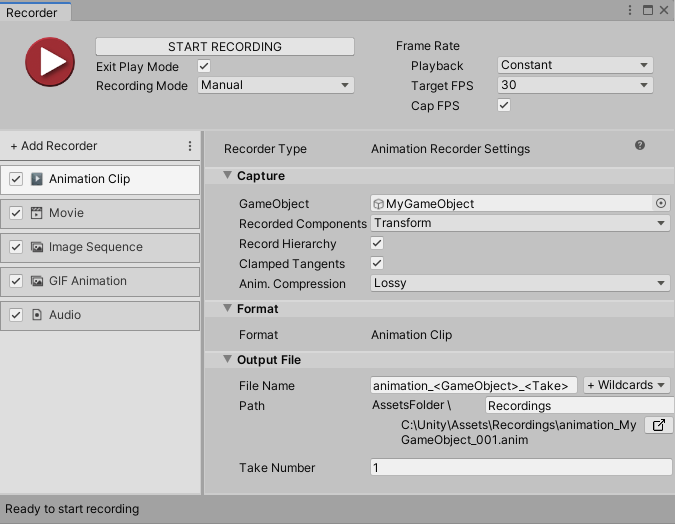

# Animation Clip Recorder properties

The **Animation Clip Recorder** generates an animation clip in Unity Animation file format (.anim extension).

This page covers all properties specific to the Animation Clip Recorder type.

> **Note:** To fully configure any Recorder, you must also set the general recording properties according to the recording interface you are using: the [Recorder window](RecorderWindowRecordingProperties.md) or a [Recorder Clip](RecordingTimelineTrack.md#recorder-clip-properties).

The Animation Clip Recorder properties fall into three main categories:
* [Capture](#capture)
* [Format](#format)
* [Output File](#output-file)

## Capture

Use this section to define the source and the content of your recording.

|Property||Function|
|:---|:---|:---|
| **GameObject** ||The [GameObject](https://docs.unity3d.com/Manual/class-GameObject.html) to record.|
| **Recorded Component(s)** ||The components of the GameObject to record. Choose more than one item to record more than one component.|
| **Record Hierarchy** ||Enable this property to record the GameObject's child GameObjects.|
| **Clamped Tangents** || Enable this option to set all [key tangents](https://docs.unity3d.com/Manual/EditingCurves.html) of the recorded animation to **Clamped Auto**. Disabling the option sets the tangents to **Auto** (legacy). Clamped tangents are useful to prevent curve overshoots when the animation data is discontinuous. |
| **Anim. Compression** || Specifies the keyframe reduction level to use to compress the recorded animation curve data. |
| | Lossy | Applies an overall keyframe reduction. The Recorder removes animation keys based on a relative tolerance of 0.5 percent, to overall simplify the curve. This reduces the file size but directly affects the original curve accuracy. |
| | Lossless | Applies keyframe reduction to constant curves only. The Recorder removes all unnecessary keys when the animation curve is a straight line, but keeps all recorded keys as long as the animation is not constant. |
| | Disabled | Disables the animation compression. The Recorder saves all animation keys throughout the recording, even when the animation curve is a straight line. This might result in large files and slow playback. |

>[!NOTE]
>The Animation Clip Recorder can only record a GameObject in the current Scene. It cannot record GameObjects in other Scenes.

## Format

The Animation Clip Recorder always generates an animation clip in the .anim file format.

## Output File

Use this section to specify the output **Path** and **File Name** pattern to save the recorded animation clip.

> **Note:** [Output File properties](OutputFileProperties.md) work the same for all types of recorders.
