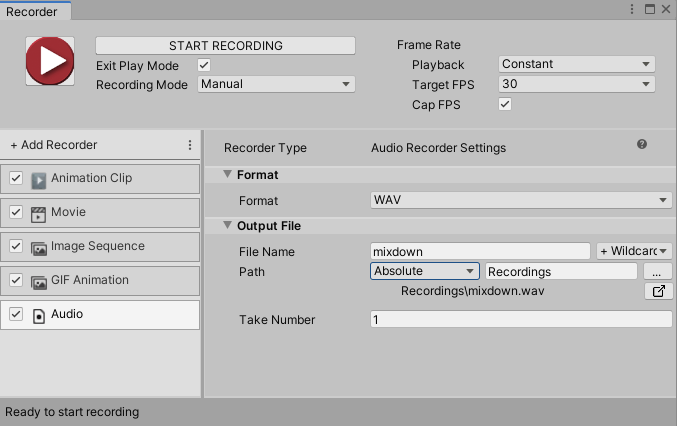

# Audio Recorder properties

The **Audio Recorder** generates an audio clip in WAV format.

This page covers all properties specific to the Audio Recorder type.

> **Note:** To fully configure any Recorder, you must also set the general recording properties according to the recording interface you are using: the [Recorder window](RecorderWindowRecordingProperties.md) or a [Recorder Clip](RecordingTimelineTrack.md#recorder-clip-properties).

The Audio Recorder properties fall into two main categories:
* [Format](#format)
* [Output File](#output-file)

## Format

Use this section to set up the media format you need to save the recorded images in.

|Property|Function|
|:---|:---|
| **Format** | The encoding format for Recorder output. **WAV** is the only possible option. |

## Output File

Use this section to specify the output **Path** and **File Name** pattern to save the recorded animation clip.

> **Note:** [Output File properties](OutputFileProperties.md) work the same for all types of recorders.
