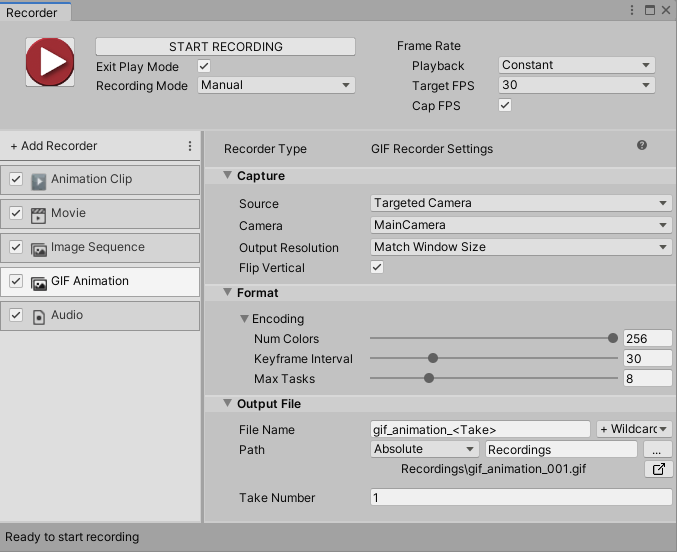

#  GIF Animation Recorder properties

The **GIF Animation Recorder** generates an animated GIF file.

This page covers all properties specific to the GIF Animation Recorder type.

> **Note:** To fully configure any Recorder, you must also set the general recording properties according to the recording interface you are using: the [Recorder window](RecorderWindowRecordingProperties.md) or a [Recorder Clip](RecordingTimelineTrack.md#recorder-clip-properties).

The GIF Animation Recorder properties fall into three main categories:
* [Capture](#capture)
* [Format](#format)
* [Output File](#output-file)

## Capture

Use this section to define the source and the content of your recording.

|Property||Function|
|:---|:---|:---|
| **Source** || Specifies the input for the recording. |
|| Targeted Camera |Records frames captured by a specific camera, even if the Game View does not use that camera.  Selecting this option displays the [Targeted Camera capture properties](#targeted-camera).|
|| Render Texture Asset |Records frames rendered in a Render Texture.  Selecting this option displays the [Render Texture Asset capture properties](#render-texture-asset).|
|| Texture Sampling |Supersamples the source camera during the capture to generate anti-aliased images in the recording.  Selecting this option displays the [Texture Sampling capture properties](#texture-sampling).|
| **Flip Vertical** ||When you enable this option, the Recorder flips the output image vertically. This is useful to correct for systems that output video upside down.|

### Targeted Camera
[!include]

### Render Texture Asset
[!include]

### Texture Sampling
[!include]

## Format

Use this section to set up the media format you need to save the recorded images in.

|Property|Function|
|:---|:---|
| **Num Colors** |The number of colors used in the GIF palette table. The maximum is 256 colors. Specify a smaller palette to reduce the size of the GIF file while reducing image quality.|
| **Keyframe Interval** |The number of frames that share the same color palette. Increase this number to reduce the size of the GIF file while reducing image quality.|
| **Max Tasks** |The number of frames to encode in parallel. If you increase this number, it might reduce the amount of time Unity takes to encode the GIF file.|

## Output File

Use this section to specify the output **Path** and **File Name** pattern to save the recorded animation clip.

> **Note:** [Output File properties](OutputFileProperties.md) work the same for all types of recorders.
