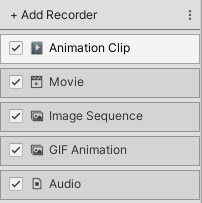

# Recorder list

Use the Recorder list to create and manage your list of Recorders in the [Recorder window](RecordingRecorderWindow.md). You can use more than one Recorder at the same time to capture Play mode data. Each Recorder controls a single recording, and its properties depend on the type of data to record and the type of output to generate.

The Recorder list allows you to:

- Add, rename, edit, duplicate, and delete Recorders.
- Save the current Recorder list as a reusable asset, load an existing Recorder list, or delete Recorder lists.

## Adding and editing Recorders

### Adding a new Recorder

1. From the Recorder list, click **+ Add Recorder**.
1. From the context menu, choose the type of Recorder to add.

The new Recorder appears in the Recorder list. Select it to [edit its properties](RecorderProperties.md) in the Recorder properties pane.

### Renaming a Recorder

1. Select the Recorder you want to rename, then click its name.
2. Type the new name, then press **Enter** or click anywhere outside of the name field.

### Duplicating a Recorder

* Right-click the Recorder you want to duplicate, and choose **Duplicate** from the context menu.
 OR
* Select the Recorder you want to duplicate and use the **Ctrl/Cmd + D** shortcut.

### Deleting a Recorder

* Right click the Recorder you want to delete and choose **Delete** from the context menu.
 OR
* Select the Recorder you want to delete and:
  * On Windows or Linux, press **Delete**, or
  * On Mac, use the **Cmd + Delete** shortcut.

## Managing Recorder lists

You can save all of the Recorders in the Recorder List pane as a single reusable asset. This is useful to quickly switch between sets of Recorders.

To save, load, or clear settings for all Recorders:

1. Open the Recorder window (menu: **Windows > General > Recorder > Recorder window**).

2. In the Recorder list, click the drop-down menu.

3. Do one of the following:

    * To save your Recorder list as an asset, select **Save Recorder List**.

    * To load a Recorder list, select **Load Recorder List > _[LIST ASSET]_**.

    * To delete all Recorders in your list, select **Clear Recorder List**.
