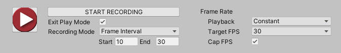

# General recording properties

Use the general recording properties to simultaneously start or stop recordings for all active Recorders in the Recorder List (listed in the [Recorder window](RecordingRecorderWindow.md)). You can specify the recording duration and frame rate.

## Recorder controls and Recording Mode

|Property||Function|
|:---|:---|:---|
| **[Record Button]**   | | [Starts](#starting-a-recording) or [stops](#stopping-a-recording) a recording session.  |
| **Start Recording**/ **Stop Recording** | | This button has exactly the same function and behavior as the Record Button (see above). |
|**Exit Play Mode**   | | When you enable this option, the Unity Recorder automatically exits Play mode when it finishes recording.  |
| **Recording Mode** ||Allows you to specify the frames or time interval to record.|
||_Manual_ |Start or stop recording when you manually click **Start Recording** or **Stop Recording**, respectively.|
|| _Single Frame_ |Record a single frame. Use the **Target Frame** property to specify this frame.|
|| _Frame Interval_ |Record a set of consecutive frames during Play mode. Use the **Start** and **End** properties to specify when to start and stop.|
|| _Time Interval_ |Record a specific duration, in seconds, during Play mode. Use the **Start** and **End** properties to specify when to start and stop.|
| **Target Frame** ||Specifies the number of the frame to capture when in **Single Frame** mode.|
| **Start**/   **End** ||• In **Frame Interval** mode, these values specify the range of frames to capture. • In **Time Interval** mode, these values specify the time, in seconds, to start and stop recording.|

## Frame Rate properties

Use the **Frame Rate** properties to specify how to constrain the frame rate during recording. The frame rate affects the size and number of the files the Recorder outputs.

|Property||Function|
|:---|:---|:---|
| **Playback** ||Specifies how to control the frame rate during recording.|
|| _Constant_ |Limit the Recorder to a specific frame rate. Use the **Target** property to specify this rate.|
|| _Variable_ |Use the application's frame rate. Specify the upper limit of the application's rate during recording with the **Max FPS** property.   **Note:** The **Movie Recorder** does not support a variable frame rate.|
| **Target FPS** ||Sets the frame rate to capture the recording at. This property appears when you set **Playback** to **Constant**.    The Unity Recorder captures at this rate regardless of whether you run your application at a higher or lower frame rate. For example, if you set **Target FPS** to a custom value of 30 fps but you run your application at 60 fps, the Recorder captures at 30 fps.|
| **Max FPS** ||Limit the rate of updates in Play mode . This property is available when you set **Playback** to **Variable**. To prevent your application from exceeding this frame rate, the Unity Recorder inserts delays during playback. Use this property to reduce the size of the output.|
| **Cap FPS** ||Enable this property when the frame rate of your application is faster than the **Target FPS**. This property is available when **Playback** is **Constant**.|

## Starting a recording

When you use the Recorder window, you must always start the recording manually. When you start a recording, the Unity Recorder activates Play mode (if it is not already active) and starts to capture Play mode data using all active Recorders.

To start recording, you can do any of the following:
  - In the Recorder window, select the Record button or the **START RECORDING** button.
  - Press **F10**/**fn+F10**.
  - From the main menu, select **Window > General > Recorder > Quick Recording**.

> **Note:** During recording, you cannot modify the properties in the Recorder window.

## Stopping a recording

Most **Recording Mode** settings stop the recording automatically, although you can manually stop it before it finishes. If you set **Recording Mode** to **Manual**, you must stop the recording yourself.

To stop recording, you can do any of the following:
  - In the Recorder window, select the Record button or the **STOP RECORDING** button.
  - Use the **F10**/**fn+F10** shortcut.
  - Close the Recorder window.
  - Exit Play mode.

> **Note:** When a recording stops, the Editor remains in Play mode unless you enable the **Exit PlayMode** property in the [recorder controls](#recorder-controls-and-recording-mode).
