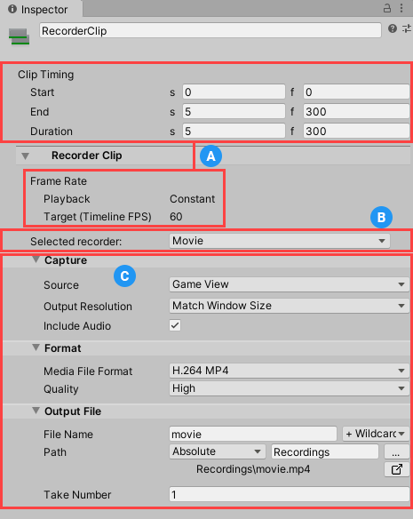

# Recording from a Timeline track

If you installed [Timeline](https://docs.unity3d.com/Packages/com.unity.timeline@latest), you can control your recordings through Recorder Clips in Timeline Tracks.

> **Note:** If you want to record from the Recorder window, see [Recording from the Recorder window](RecordingRecorderWindow.md).

## Recorder Tracks and Recorder Clips

To record through Timeline, you must add at least one **Recorder Track** with at least one  **Recorder Clip** in it. The Recorder Clip defines a recording for the Recorder to capture while Timeline plays the Recorder Track.

You can use multiple Recorder Clips in the same Recorder Track to record data at different times of your Timeline sequence.

To record multiple types of data at the same time, you must use multiple Recorder Tracks.

## Setting up a Recorder Clip

To set up a recording session in a Timeline instance:

1. Select the GameObject associated with the Timeline Asset.

1. In the Timeline window, select the Add (**+**) button and select **UnityEditor.Recorder.Timeline > Recorder Track**.
    

1. Right-click the **Recorder Track** you just added and select **Add Recorder Clip**.

1. Select the **Recorder Clip** and [set up its properties](#recorder-clip-properties) in the **Inspector**.

## Recorder Clip properties

###  General recording properties

The Recorder Clip's **Clip Timing** properties control the recording's **Start**, **End**, and **Duration**.

>**Note:** The **Frame Rate Playback** property is locked to **Constant** mode, because Timeline plays back at a constant frame rate. Also, the Recorder Clip inherits its **Frame Rate Target** setting from the Timeline’s **Frame Rate** setting.

###  Recorder selection

Select the type of Recorder you want the Recorder Clip to use.
 You can also load any existing Recorder Preset, or save the current Recorder Clip settings as a Preset.

###  Recorder properties

Use this section to [set up the properties of the selected Recorder](RecorderProperties.md).
 Recorder properties include Capture, Format and Output File properties.

## Starting and stopping the recording

- The recording automatically starts when the Timeline plays the Recorder Clip, according to the **Start** setting value of the clip.

- The recording automatically stops when the Recorder Clip reaches its **End** setting value or if you manually stop the Timeline.

See the [Timeline](https://docs.unity3d.com/Packages/com.unity.timeline@latest) documentation for more information about managing and playing Timeline tracks and clips.
